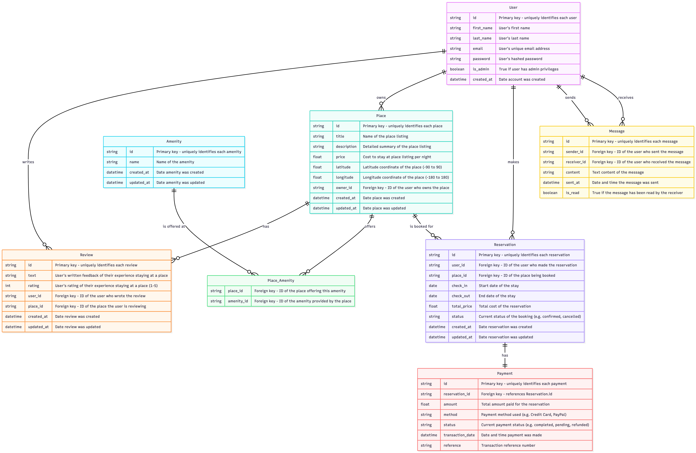

# Part 3

## Table of Contents

- [Part 3 Project Structure](/part3/README.md#part-3-app-structure)
- [Part 3 Overview](/part3/README.md#Part-3-Overview)
- Jump to [Application Setup Instructions](/part3/hbnb/README.md)
- Jump to [Test Documentation](https://github.com/kayrbee/holbertonschool-hbnb/blob/master/part3/hbnb/tests/test_documentation.md)

## Part 3 Project Structure

```
holbertonschool-hbnb/
├── part1/    # truncated for clarity
├── part2/    # truncated for clarity
├── part3/
│   ├──hbnb/
│   │   ├── app/
│   │   │   ├── api/
│   │   │   │   ├── v1/
│   │   │   │       ├── __init__.py
│   │   │   │       ├── amenities.py
│   │   │   │       ├── auth.py
│   │   │   │       ├── places.py
│   │   │   │       ├── reviews.py
│   │   │   │       ├── users.py
│   │   │   │   ├── __init__.py
│   │   │   ├── models/
│   │   │   │   ├── __init__.py
│   │   │   │   ├── amenity.py
│   │   │   │   ├── base_class.py
│   │   │   │   ├── place.py
│   │   │   │   ├── review.py
│   │   │   │   ├── user.py
│   │   │   ├── persistence/
│   │   │       ├── __init__.py
│   │   │       ├── repository.py
│   │   │   ├── services/
│   │   │   │   ├── __init__.py
│   │   │   │   ├── facade.py
│   │   │   ├── __init__.py  # Contains def create_app()
│   │   │   ├── .env-example
│   │   ├── tests/
│   │   │   ├── test_amenity.py
│   │   │   ├── test_documentation.md  # How to run the project's test suites
│   │   │   ├── test_place.py
│   │   │   ├── test_review_api.py
│   │   │   ├── test_review_class.py
│   │   │   ├── test_review_class.py
│   │   │   ├── users_test.py
│   │   ├── config.py
│   │   ├── README.md    # How to run the application
│   │   ├── requirements.txt
│   │   ├── run.py
│   ├── README.md    # You are here
├── .gitignore
├── README.md
```

## Part 3 Overview

### Enhanced Backend with Authentication and Database Integration

Welcome to **Part 3 of the HBnB Project**, where you will extend the backend of the application by introducing **user authentication, authorization, and database integration** using **SQLAlchemy** and **SQLite** for development.  
Later, you’ll configure **MySQL** for production environments. In this part, you will secure the backend, introduce persistent storage, and prepare the application for a scalable, real-world deployment.

---

## 🎯 Objectives of the Project

### **Authentication and Authorization**
- Implement **JWT-based user authentication** using `Flask-JWT-Extended`.
- Add **role-based access control** with an `is_admin` attribute for specific endpoints.

### **Database Integration**
- Replace **in-memory storage** with **SQLite** for development using **SQLAlchemy** as the ORM.
- Prepare the system for **MySQL** or other production-grade RDBMS.

### **CRUD Operations with Database Persistence**
- Refactor all CRUD operations to interact with a **persistent database**.

### **Database Design and Visualization**
- Design the database schema using **mermaid.js**.
- Ensure all relationships between entities are correctly mapped.

### **Data Consistency and Validation**
- Enforce proper **data validation** and **constraints** within models.

---

## 🧠 Learning Objectives

By the end of this part, you will:

- Implement **JWT authentication** to secure your API and manage user sessions.  
- Enforce **role-based access control** to restrict access based on user roles (regular users vs. administrators).  
- Replace in-memory repositories with a **SQLite-based persistence layer** using SQLAlchemy for development and configure **MySQL for production**.  
- Design and visualize a **relational database schema** using **mermaid.js** to handle relationships between users, places, reviews, and amenities.  
- Ensure the backend is **secure, scalable**, and provides **reliable data storage** for production environments.  

---

## 🧩 Project Context

In the previous parts of the project, you worked with **in-memory storage**, which is ideal for prototyping but insufficient for production environments.  
In **Part 3**, you’ll transition to **SQLite**, a lightweight relational database, for development, while preparing the system for **MySQL** in production.  
This will give you hands-on experience with **real-world database systems**, allowing your application to scale effectively.

Additionally, you’ll introduce **JWT-based authentication** to secure the API, ensuring that only authenticated users can interact with certain endpoints.  
You will also implement **role-based access control** to enforce restrictions based on the user’s privileges (**regular users vs. administrators**).

---

## 📚 Project Resources

Here are some resources that will guide you through this part of the project:

- [Flask-JWT-Extended Documentation](https://flask-jwt-extended.readthedocs.io/) — JWT Authentication  
- [SQLAlchemy Documentation](https://www.sqlalchemy.org/) — ORM for Python  
- [SQLite Documentation](https://www.sqlite.org/docs.html) — Lightweight SQL Database  
- [Flask Official Documentation](https://flask.palletsprojects.com/) — Web Framework  
- [Mermaid.js Documentation](https://mermaid.js.org/) — For ER Diagrams  

---

## 🏗️ Structure of the Project

In this part of the project, the tasks are organized in a way that builds progressively towards a **complete, secure, and database-backed backend system**:

1. **Modify the User Model to Include Password**  
   - Store passwords securely using `bcrypt`.  
   - Update the user registration logic.

2. **Implement JWT Authentication**  
   - Secure the API using **JWT tokens**.  
   - Ensure only authenticated users can access protected endpoints.

3. **Implement Authorization for Specific Endpoints**  
   - Add **role-based access control** to restrict admin-only actions.

4. **SQLite Database Integration**  
   - Transition from **in-memory data storage** to **SQLite** as the persistent database during development.

5. **Map Entities Using SQLAlchemy**  
   - Map existing entities (**User**, **Place**, **Review**, **Amenity**) to the database.  
   - Define relationships and constraints.

6. **Prepare for MySQL in Production**  
   - Configure the application to use **MySQL** in production and **SQLite** in development.

7. **Database Design and Visualization**  
   - Use **mermaid.js** to create **entity-relationship diagrams (ERDs)** for your database schema.

   #### Base Database Schema
   The first diagram below illustrates the **core entities** and their relationships:
   - **User**
   - **Place**
   - **Review**
   - **Amenity**
   - **Place_Amenity** (join table for many-to-many relationship between Place and Amenity)

   This visualization shows how users own places, write reviews, and how places can have multiple amenities.

   **Base ER Diagram**
   

   #### Extended Schema (Understanding Relationships)
   To demonstrate understanding of database relationships and scalability, additional entities were added:
   - **Reservation** – links a user to a place booking  
   - **Payment** – records transactions for reservations  
   - **Message** – allows communication between users

   These additions show one-to-many and many-to-one relationships in a real-world application context.

   **Extended ER Diagram**
   

---

## ✅ Outcome

By the end of **Part 3**, you will have a backend that:

- Stores data in a **persistent and secure database**  
- Implements **JWT-based authentication and authorization**  
- Enforces **role-based access control**  
- Is **ready for production deployment** with a scalable database setup  

You will have implemented **industry-standard authentication** and **database management practices** — essential for real-world web applications.

---
